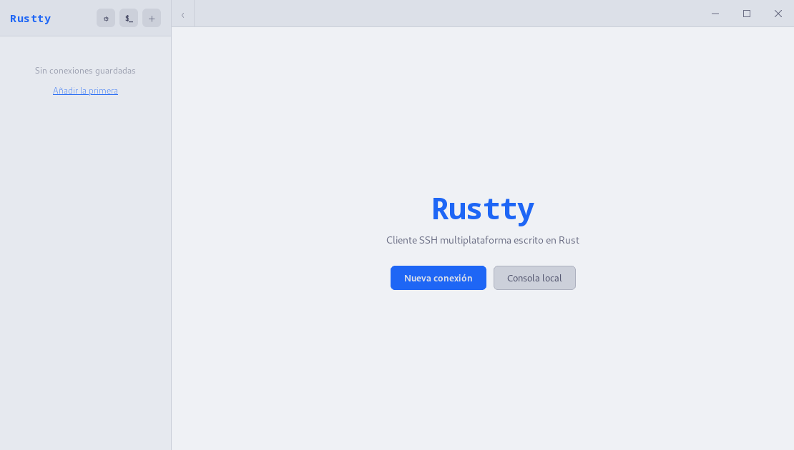
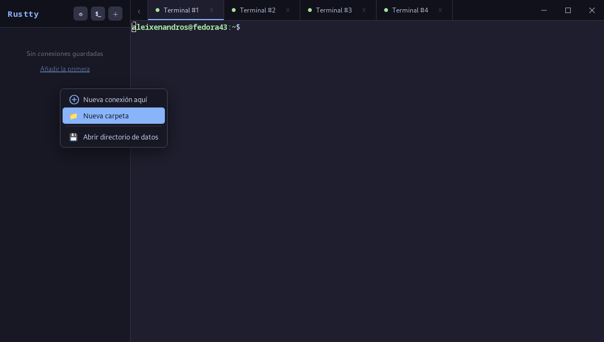
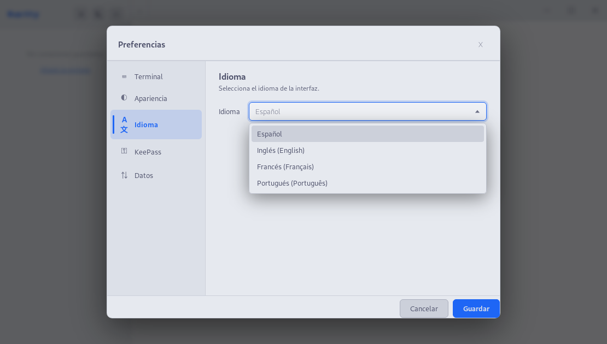

# Rustty - Cliente SSH Multiplataforma🦀⚡

> 🌐 English version: [README.en.md](README.en.md)

> ⚠️ **Aviso**: este repositorio contiene código y documentación generados en parte con agentes de IA.
> Las contribuciones y/o críticas son bienvenidas.

**Rustty** es un cliente de terminal y gestor de conexiones multiplataforma, moderno y ligero, diseñado para ofrecer una experiencia fluida en la administración de servidores remotos. Construido con **Rust** y **Tauri**, combina la potencia de las herramientas de bajo nivel con una interfaz web moderna y ágil.

## Características principales

- **Multi-protocolo**: conexiones SSH, SFTP, FTP, FTPS y RDP (este último mediante `xfreerdp` / `mstsc` externos).
- **Terminal moderno**: xterm.js con renderizado por GPU (WebGL), temas, cursor configurable, scrollback, **búsqueda dentro del buffer** (Ctrl+F), cola de salida con drenado por lotes para que comandos muy verbosos (`cat` de logs grandes, `journalctl`, etc.) no congelen la interfaz, barra inferior con estado/latencia/diagnóstico, soporte de OSC 7 (seguimiento del `cwd` remoto) y **editor multilínea de comandos** (Ctrl+Shift+E) para redactar instrucciones largas con borrador por perfil y un **historial de comandos compartido entre pestañas** (opt-in) accesible desde ese mismo editor.
- **Snippets, comandos y paleta**: biblioteca de **snippets** insertables en el terminal activo y catálogo de **comandos locales** (ejecutar un comando, abrir una URL o una carpeta) configurables en Preferencias → Comandos, ambos con sustituciones `${host}/${user}/${var:…}/${ask:…}` y confirmación opcional. Una **paleta de comandos global** (`Ctrl+Shift+P`) ofrece búsqueda difusa sobre perfiles, snippets, comandos y acciones de la app. Además, **plantillas de perfil** integradas (Linux SSH, SSH con clave, bastión, SSH heredado, RDP, FTPS) para crear conexiones con valores por defecto, pudiendo marcar tus propios perfiles como plantilla.
- **Notas Markdown por conexión (runbooks)**: clic derecho sobre una conexión para **añadir o editar una nota en Markdown**, con editor de previsualización en vivo, barra de formato, título y etiquetas. Cada nota se guarda como un archivo `.md` autocontenido (sincronizable, opt-in en Copias de seguridad), resuelve variables `${host}/${user}/…` en la vista y puede mostrarse como **panel runbook** junto a la sesión con casillas de tarea interactivas. Atajo `Ctrl+Shift+M`.
- **Panel de ficheros integrado**: explorador SFTP/FTP/FTPS con **vista dividida remoto / local** (con el remoto a la izquierda o a la derecha, configurable en Preferencias → Estética), transferencia recursiva de carpetas, drag & drop entre paneles **y desde el explorador del sistema operativo** (soltar ficheros/carpetas sobre el panel remoto los sube), conflictos configurables, cola de transferencias, logs en pestañas redimensionables, menús contextuales, **autocompletado de rutas** (`Tab` y desplegable de sugerencias), **búsqueda de ficheros** por nombre en el directorio actual o recursiva, creación de carpetas y archivos vacíos en ambos lados, seguimiento opcional del directorio del terminal en SSH y modo elevado a **sudo** cuando el servidor lo permita. Las transferencias SFTP usan **pipelining** (peticiones simultáneas en vuelo de 256 KiB, configurable en Preferencias) y saturan el ancho de banda real de la conexión en lugar de quedarse limitadas por el RTT; el número de peticiones en paralelo se puede bajar para servidores con límite de handles (p. ej. Hetzner Storage Box).
- **CLI SSH**: lista conexiones guardadas con `rustty -l`, conecta directamente con `rustty -c <nombre|id|ip|host>` y ejecuta comandos remotos con `--exec`, `--` o el alias `rustty -c <perfil> "cmd"`, sin abrir la interfaz gráfica.
- **Túneles SSH integrados**: redirección de puertos **local** (`-L`), **remota** (`-R`) y **dinámica / SOCKS** (`-D`) sobre una sesión activa o desde acceso rápido global, con panel de estado, tráfico, túneles guardados y autoconexión opcional por perfil.
- **Opciones avanzadas SSH por perfil**: keep-alive configurable, **reconexión automática con backoff** ante caídas, **grabación de sesión** a fichero, bastion / ProxyJump, agent forwarding, X11 forwarding y opción para permitir cifrados / kex / MAC legacy (aes-cbc, 3des-cbc, dh-sha1, hmac-sha1, ssh-rsa) en servidores antiguos, pudiendo elegir qué algoritmos concretos ofrecer.
- **Varios usuarios por conexión**: añade identidades adicionales a un perfil (cada una con su propia autenticación: contraseña, credencial maestra, clave SSH o agente). Al conectar se usa la principal; con clic derecho → **«Conectar con otro usuario»** eliges una identidad alternativa, y `Ctrl+P` pega la contraseña del usuario con el que se inició esa sesión. Disponible en SSH, RDP y SFTP/FTP.
- **Restaurar pantalla anterior**: clic derecho → **«Conectar y restaurar pantalla anterior»** reconecta repintando lo que se vio en la última sesión (restauración *visual* del scrollback, no del proceso remoto). La captura se guarda por perfil en disco y puede desactivarse en Preferencias → Terminal; no se sincroniza.
- **Multi-pestaña y vistas divididas**: trabaja con varias sesiones simultáneas, distribúyelas en *split* horizontal / vertical / grid y activa el *broadcast* para teclear en varias a la vez.
- **Sidebar pulida**: rail vertical de iconos (Perfiles, Favoritos, Túneles, Actividad, Sync, Preferencias y acciones rápidas), **drag & drop** entre carpetas y workspaces, colores por carpeta, recuerdo del árbol abierto y selección automática de la conexión asociada a la pestaña activa.
- **Diagnóstico y actividad**: botón **Probar** en el modal de conexión sin guardar el perfil, logs SSH por etapas, comprobación TCP para RDP/FTP/FTPS y centro global de actividad persistente con transferencias, sync, errores y actualizaciones agrupados por día.
- **Bandeja del sistema / quick launcher**: acceso rápido a favoritos, recientes, workspaces, consola local, **Wake On LAN** de los perfiles con MAC y abrir/ocultar ventana desde el icono de tray. Opción de **iniciar Rustty con el sistema** y **arrancar minimizado** en la bandeja (opt-in, en Preferencias → Sistema).
- **Exportación granular**: exporta todos los perfiles, los de una carpeta o los de un workspace a JSON desde el menú contextual, preguntando antes si debe incluir contraseñas/passphrases guardadas.
- **Importación desde otras herramientas**: importa tu `~/.ssh/config` o, con un **asistente por pasos**, conexiones de **mRemoteNG** (`.xml`) o **Ásbrú Connection Manager** (`.yml`) — reconstruye el árbol de carpetas en un perfil-contenedor nuevo, deja elegir qué importar, muestra el progreso y descifra opcionalmente las contraseñas guardadas (todo en local).
- **Seguridad**:
  - Integración nativa con el keyring del sistema (Secret Service/KWallet en Linux, macOS Keychain, Windows Credential Store).
  - Soporte para bases de datos **KeePass** (`.kdbx`) como fuente de contraseñas.
  - **Credenciales maestras** reutilizables: define una contraseña una vez y refiérela desde varios perfiles con `${master:nombre}`; el valor vive solo en el keyring y rotarlo actualiza todos los perfiles que la usan. Forma parte de un **motor de variables** (`${host}`, `${env:…}`, `${var:…}`, `${ask:…}`) que se resuelve al conectar, también en campos como el host o el usuario.
  - Atajo `Ctrl+P` para pegar la contraseña del perfil activo (la del **usuario con el que se conectó** la sesión, si se usó un usuario adicional) sin exponerla en pantalla; solo se envía a la sesión SSH conectada y enfocada, y queda bloqueado mientras el *broadcast* está activo para no difundir el secreto.
  - **Sesión privada / efímera** ("Abrir en privado" desde el menú del perfil): no deja rastro en recientes, centro de actividad, borradores ni grabación de sesión, y la pestaña se marca como privada.
  - Verificación de `known_hosts` con TOFU y aviso ante cambios de fingerprint, más un **gestor visual de `known_hosts`** en Preferencias para revisar huellas y eliminar entradas conflictivas.
  - Aviso y confirmación al **activar el agent forwarding**, para no compartir el agente SSH con hosts no confiables sin darse cuenta.
  - **Retención configurable de los logs de sesión** (por edad y tamaño) con limpieza manual y aviso de contenido sensible.
- **Copias de seguridad y sincronización E2E**: perfiles, preferencias, temas, atajos, notas de conexión y, si lo activas, contraseñas guardadas pueden sincronizarse con Google Drive, iCloud Drive, carpeta local / NAS o WebDAV. El blob remoto se cifra localmente con `age` y una passphrase maestra. Sincronización **por evento** (comprueba al iniciar y sincroniza si hay cambios locales/remotos) y **restauración de snapshots históricos** desde la pestaña de Copias.
- **Organización**: agrupa conexiones en **perfiles-contenedor (workspaces)** independientes, en carpetas dentro de cada workspace, **conexiones favoritas** y vistas de la sidebar (workspace actual, todos los perfiles, favoritos), búsqueda rápida y duplicación de conexiones / sesiones desde el menú contextual. **Orden alfabético o manual** de carpetas y conexiones: en modo manual, «Mover arriba / abajo» desde el menú contextual de cada carpeta o máquina.
- **Personalización**: 12 temas base integrados y una biblioteca ampliada de 221 temas Rustty v2 precargados para interfaz y terminal, además de ajustes de cursor, scrollback y *bell*. Posibilidad de importar temas personalizados en formato JSON v2 con tokens de UI y terminal. **Tamaño de la interfaz ajustable** (rail, sidebar, pestañas y modales) independiente del terminal, con control en Preferencias y atajos `Ctrl+Alt` con `+` / `-` / `0`.
- **Internacionalización**: interfaz traducida a español, inglés, francés, portugués y alemán. (Traducciones realizadas con IA)

## Capturas

Pantalla de bienvenida con el tema claro del sistema:



Varias sesiones abiertas en pestañas y menú contextual del panel de conexiones (tema oscuro):



Vista dividida en rejilla: cuatro paneles en la misma pestaña con el selector de *layout* en la esquina superior derecha:


Preferencias → **Apariencia**: tema global de la interfaz y tema independiente del terminal (con el *swatch* "Igual que la interfaz" para herencia):


Preferencias → **Idioma**: interfaz disponible en español, inglés, francés y portugués:



## Atajos de teclado

Rustty incluye un **editor de atajos** en Preferencias → *Atajos* que permite reasignar cualquier acción con captura en vivo (pulsa "Editar" y la nueva combinación). Los atajos por defecto son:

| Atajo                          | Acción                                                 |
|--------------------------------|--------------------------------------------------------|
| `Ctrl+Shift+N`                 | Nueva conexión                                         |
| `Ctrl+Shift+T`                 | Nueva consola local                                    |
| `Ctrl+W`                       | Cerrar pestaña activa                                  |
| `Ctrl+Tab`                     | Pestaña siguiente                                      |
| `Ctrl+Shift+Tab`               | Pestaña anterior                                       |
| `Ctrl+,`                       | Abrir preferencias                                     |
| `Ctrl+Alt+C`                   | Copiar selección del terminal                          |
| `Ctrl+Alt+V`                   | Pegar en el terminal                                   |
| `Ctrl+P`                       | Pegar la contraseña del perfil activo en el shell      |
| `Ctrl+Shift+E`                 | Abrir el editor multilínea de comandos                 |
| `Ctrl+Shift+P`                 | Abrir la paleta de comandos global                     |
| `Ctrl+K`                       | Buscar conexiones desde cualquier vista                |
| `Ctrl+F`                       | Buscar dentro del buffer del terminal                  |
| `Ctrl++` / `Ctrl+-` / `Ctrl+0` | Aumentar / disminuir / restablecer el tamaño de fuente |

## CLI SSH

Rustty también puede usarse desde terminal para trabajar con conexiones SSH guardadas:

```bash
rustty -l
rustty --list
rustty -l --json
rustty -c <nombre|id|ip|host>
rustty --connect <nombre|id|ip|host>
rustty -c <nombre|id|ip|host> --exec "uptime"
rustty -c <nombre|id|ip|host> -- hostname
rustty -c <nombre|id|ip|host> "hostname"
rustty -c <nombre|id|ip|host> --tty -- sudo systemctl status nginx
```

`-c` reutiliza los datos del perfil, el keyring del sistema, `known_hosts`, ProxyJump, keepalive, agent forwarding y la compatibilidad legacy configurada en la conexión. Si una contraseña o passphrase no está guardada en el keyring, la pedirá en la terminal sin mostrarla.

Cuando se añade un comando remoto, Rustty abre un canal SSH `exec`, escribe `stdout`/`stderr` en la terminal local y termina con el código de salida remoto. `--exec` es la forma recomendada para comandos con comillas o tuberías; `--` acepta una forma breve similar a `ssh`, y el texto extra después del perfil queda como alias cómodo. `--tty` solicita pseudo-terminal para comandos que lo necesiten, como algunos usos de `sudo`.

## Instalación

En cada release de GitHub encontrarás binarios precompilados para Linux, Windows y macOS. Puedes descargarlos desde la página de [Releases](https://github.com/Aleixenandros/Rustty/releases) o desde la web del proyecto: [rustty.es/descargas](https://rustty.es/descargas).

### Instalación rápida con script

En Linux y macOS puedes instalar Rustty con el script oficial:

```bash
curl -sSf https://rustty.es/install.sh | sh
```

El script consulta la última release publicada, detecta tu sistema y descarga el artefacto adecuado. Internamente invoca `sudo` solo cuando lo necesita el gestor de paquetes; **no** ejecutes `sudo sh` sobre todo el script.

Si prefieres revisarlo antes:

```bash
curl -sSf https://rustty.es/install.sh -o install.sh
less install.sh
sh install.sh
```

| Sistema detectado | Artefacto usado | Instalación |
| --- | --- | --- |
| Arch / Manjaro / EndeavourOS | `.pkg.tar.zst` | `sudo pacman -U` |
| Debian / Ubuntu / Mint | `.deb` | `sudo apt-get install` |
| Fedora / RHEL / CentOS / Rocky / AlmaLinux | `.rpm` | `sudo dnf install` |
| openSUSE / SUSE | `.rpm` | `sudo zypper install` |
| Otras distribuciones Linux | `AppImage` | copia en `~/.local/bin/rustty` |
| macOS Apple Silicon | `.app.tar.gz` | extrae en `~/Applications/Rustty.app` |

Para actualizar a una nueva versión, vuelve a ejecutar el mismo comando. En Linux reemplazará el paquete mediante el gestor correspondiente; en macOS reemplazará `~/Applications/Rustty.app`.

> El instalador automático no está disponible para Windows. Usa el MSI, NSIS o portable de la release.

### Linux

Rustty necesita **WebKitGTK 4.1** y **libayatana-appindicator** en tiempo de ejecución (en la mayoría de distribuciones ya están instalados o se resuelven como dependencia al instalar el paquete).

- **AppImage (`Rustty_<version>_amd64.AppImage`)** — portable, no requiere instalación:

  ```bash
  chmod +x Rustty_*_amd64.AppImage
  ./Rustty_*_amd64.AppImage
  ```

- **.deb (Debian / Ubuntu / Mint / ...)**:

  ```bash
  sudo apt install ./Rustty_*_amd64.deb
  ```

- **.rpm (Fedora / openSUSE / RHEL / ...)**:

  ```bash
  sudo dnf install ./Rustty-*-1.x86_64.rpm        # Fedora
  sudo zypper install ./Rustty-*-1.x86_64.rpm     # openSUSE
  ```

- **.pkg.tar.zst (Arch / Manjaro / EndeavourOS / ...)**:

  ```bash
  sudo pacman -U Rustty-*-1-x86_64.pkg.tar.zst
  ```

- **Flatpak (`Rustty-<version>-x86_64.flatpak`)** — bundle autocontenido, sin añadir remotos:

  ```bash
  flatpak install ./Rustty-*-x86_64.flatpak
  flatpak run es.rustty.Rustty
  ```

  Requiere el runtime `org.freedesktop.Platform 24.08` (Flatpak lo descarga la primera vez).

  Si tu distribución no incluye WebKitGTK 4.1 por defecto, instálalo primero (ver "Requisitos previos" más abajo).

### Windows

La forma recomendada es **winget**:

```powershell
winget install rustty
```

O descarga un binario directamente del release:

- **MSI (`Rustty_<version>_x64.msi`)** — instalador tradicional. Doble clic y seguir el asistente.
- **NSIS (`Rustty_<version>_x64-setup.exe`)** — instalador alternativo, más ligero.
- **Portable (`Rustty_<version>_x64-portable.exe`)** — ejecutable único sin instalar, ideal para memorias USB o equipos bloqueados.

En todos los casos se requiere **Microsoft Edge WebView2 Runtime** (ya incluido en Windows 10 22H2 y Windows 11). Si tu sistema no lo tiene, el instalador MSI/NSIS lo descargará automáticamente; para el portable, instálalo a mano desde [aquí](https://developer.microsoft.com/microsoft-edge/webview2/).

#### Modo portable real

Cuando Rustty se ejecuta como `Rustty_<version>_x64-portable.exe` (filename con sufijo `-portable.exe`), **no usa `%APPDATA%`**. Almacena toda la configuración en una carpeta `.conf\com.rustty.app\` creada automáticamente **junto al propio ejecutable**. Esto incluye `profiles.json` y otros datos de la app, así que el USB queda *self-contained*: cópialo a otro equipo y la configuración viaja con él.

Salvedades:

- El **keyring de Windows** (Credential Manager) sigue siendo del usuario que ejecuta el binario, no del USB. Para mover credenciales entre equipos puedes usar una base **KeePass `.kdbx`** junto al portable o activar la sincronización E2E de contraseñas guardadas en **Preferencias → Copias de seguridad**.
- El estado de la ventana (tamaño, posición) sí se guarda en el perfil de usuario (plugin `tauri-plugin-window-state`); la sesión visual del USB no es 100% portable.
- Si renombras el `.exe` y le quitas el sufijo `-portable.exe`, vuelve al modo normal y leerá `%APPDATA%\com.rustty.app\`.

### macOS (Apple Silicon)

Las builds se firman con **Developer ID Application** y se notarizan con el servicio de Apple, así que Gatekeeper no muestra avisos en una instalación limpia.

La forma más rápida es el instalador automático (ver [Instalación rápida con script](#instalación-rápida-con-script)): `curl -sSf https://rustty.es/install.sh | sh`. O descarga un binario directamente del release:

- **DMG (`Rustty_<version>_aarch64.dmg`)**: abrir el `.dmg` y arrastrar `Rustty.app` a `Aplicaciones`.
- **App bundle (`Rustty_aarch64.app.tar.gz`)**: descomprimir y ejecutar `Rustty.app`.

> Las builds sólo se generan para **aarch64** (Apple Silicon). Para Intel Mac habría que compilar desde fuente.

### Verificación de integridad

Junto a cada artefacto se publica su `.sig` (firma del updater de Tauri) y la página del release incluye el `sha256` de cada fichero. Para verificar:

```bash
sha256sum Rustty_*_amd64.deb
# comparar con el hash indicado en la release
```

## Tecnologías utilizadas

- **Backend**: [Rust](https://www.rust-lang.org/) — 100% puro para SSH/SFTP y FTPS sobre `rustls` (sin dependencia de `libssh2`).
- **Framework de App**: [Tauri v2](https://tauri.app/)
- **Frontend**: [Vite](https://vitejs.dev/) + Vanilla JavaScript / CSS
- **Terminal**: [xterm.js](https://xtermjs.org/)
- **Protocolos**: [russh](https://github.com/warp-tech/russh) (SSH), [russh-sftp](https://github.com/warp-tech/russh-sftp) (SFTP), [`suppaftp`](https://github.com/veeso/suppaftp) (FTP/FTPS)
- **Seguridad**: [keyring-rs](https://github.com/hwchen/keyring-rs), [keepass-rs](https://github.com/sseemayer/keepass-rs)

## Copias de seguridad y sincronización

Rustty incluye una pestaña **Preferencias → Copias de seguridad** con tres flujos:

- **Sincronización en la nube**: Google Drive, iCloud Drive, Carpeta local / NAS o WebDAV.
- **Backup cifrado**: exporta/importa un `.rustty-sync.bin` cifrado con tu passphrase, independiente de cualquier backend.
- **Datos locales**: export/import JSON de perfiles para interoperabilidad y copias simples.

La sincronización es opt-in y cifra el estado antes de subirlo. Se sincronizan perfiles, preferencias, temas personalizados, atajos, notas de conexión y snippets. Las **contraseñas/passphrases guardadas** tienen su propio check: si lo activas, Rustty lee los secretos `password:<profile_id>` / `passphrase:<profile_id>` del keyring local, los mete en el blob cifrado E2E y los restaura en el keyring de otros equipos. La base KeePass desbloqueada y rutas locales como `keepassPath` o `keepassKeyfile` nunca se sincronizan.

Los exports JSON locales de conexiones/carpetas/workspaces preguntan antes de incluir secretos. Si eliges incluirlos, el JSON contiene credenciales legibles; usa preferiblemente el backup cifrado `.rustty-sync.bin` para transportar contraseñas.

La sincronización comprueba el estado al iniciar la app y se dispara cuando detecta cambios locales (debounce de 1 minuto). Si el contenido lógico local y remoto ya coincide, no reescribe el blob remoto ni crea un snapshot nuevo. Antes de sobrescribir un blob remoto distinto se guarda un snapshot cifrado; desde el desplegable **Restaurar copia** puedes volver a cualquier snapshot anterior disponible en el backend.

Backends:

- **Google Drive**: OAuth en navegador con callback local; Rustty usa el espacio `appDataFolder` y guarda el refresh token en el keyring.
- **iCloud Drive**: escribe en la carpeta local de iCloud Drive en macOS y deja que el sistema sincronice.
- **Carpeta local / NAS**: útil para Syncthing, carpetas compartidas o clientes cloud externos.
- **WebDAV**: compatible con Nextcloud, ownCloud y servidores WebDAV genéricos.

## Desarrollo y Construcción

Si deseas compilar el proyecto desde el código fuente, sigue estos pasos:

### Requisitos previos

1. **Rust**: [Instalar Rust](https://www.rust-lang.org/tools/install)
2. **Node.js**: v24 recomendado para igualar el workflow de CI.
3. **Dependencias de sistema**:

   #### Linux (compilación)

    **Ubuntu / Debian**:

    ```bash
    sudo apt-get install -y libwebkit2gtk-4.1-dev libappindicator3-dev librsvg2-dev patchelf libdbus-1-dev libssl-dev pkg-config
    ```

    **Fedora**:

    ```bash
    sudo dnf install webkit2gtk4.1-devel libayatana-appindicator-devel librsvg2-devel dbus-devel openssl-devel
    ```

    **Arch Linux**:

    ```bash
    sudo pacman -S webkit2gtk-4.1 libayatana-appindicator librsvg dbus openssl
    ```

    **openSUSE**:

    ```bash
    sudo zypper install webkit2gtk3-devel libayatana-appindicator3-devel librsvg-devel dbus-1-devel libopenssl-devel
    ```

   #### macOS (compilación)

    Es necesario tener instaladas las **Xcode Command Line Tools** y [Homebrew](https://brew.sh/).

    ```bash
    brew install openssl pkg-config
    ```

   #### Windows (compilación)

    Es necesario instalar las [Visual Studio C++ Build Tools](https://visualstudio.microsoft.com/visual-cpp-build-tools/) y tener instalado el **WebView2 Runtime** (incluido por defecto en Windows 10 y 11).

### Pasos para ejecutar en desarrollo

1. Clona el repositorio:

    ```bash
    git clone https://github.com/Aleixenandros/Rustty.git
    cd Rustty
    ```

2. Instala las dependencias de Node.js:

    ```bash
    npm install
    ```

3. Ejecuta la aplicación en modo desarrollo:

    ```bash
    npm run tauri dev
    ```

### Construcción para producción

Para generar el ejecutable optimizado para tu sistema operativo:

```bash
npm run tauri build
```

El binario y los paquetes (`.deb`, `.rpm`, `.AppImage`, `.msi`, `.dmg`, según plataforma) quedan en `src-tauri/target/release/bundle/`.

### Release automático

El workflow de GitHub Actions (`.github/workflows/build.yml`) compila binarios para Linux, Windows y macOS (Apple Silicon) al empujar un tag `v*`:

La fuente única de versión es `package.json`. Para preparar una release, cambia sólo el campo `version` ahí y ejecuta:

```bash
npm run sync-version
```

Ese comando sincroniza `Cargo.toml`, `Cargo.lock` y `package-lock.json`. La web pública resuelve su versión desde la última release de GitHub, no desde `package.json`. `npm run build`, `npm run tauri dev` y `npm run tauri build` también ejecutan la sincronización automáticamente.

```bash
git tag v1.0.0
git push --tags
```

Los artefactos quedan en un release de GitHub en modo borrador.

Para que las builds oficiales incluyan Google Drive, define estos secretos en GitHub Actions:

```text
RUSTTY_GOOGLE_DRIVE_CLIENT_ID
RUSTTY_GOOGLE_DRIVE_CLIENT_SECRET
```

## Rutas de datos

- **Linux**: `~/.local/share/com.rustty.app/` (perfiles, configuración)
- **macOS**: `~/Library/Application Support/com.rustty.app/`
- **Windows**: `%APPDATA%\com.rustty.app\`

Las contraseñas no se guardan en estos ficheros: viven en el keyring del sistema con el servicio `rustty`, o se resuelven desde una base KeePass referenciada por UUID. Si activas la sync de contraseñas, solo viajan dentro del blob cifrado E2E y se rehidratan de nuevo al keyring local.

La configuración de sincronización vive en `sync_config.json` y el último snapshot local en `sync_state.json`. Los secretos de sync (passphrase maestra, contraseña WebDAV y token OAuth de Google Drive) se guardan en el keyring del sistema.

---

## 📄 Licencia

Rustty se distribuye bajo la licencia [Apache License, Version 2.0](LICENSE).

```text
Copyright 2026 Alejandro Soriano

Licensed under the Apache License, Version 2.0 (the "License");
you may not use this file except in compliance with the License.
You may obtain a copy of the License at

    http://www.apache.org/licenses/LICENSE-2.0
```

Ver el fichero [NOTICE](NOTICE) para las atribuciones requeridas al redistribuir.

---
