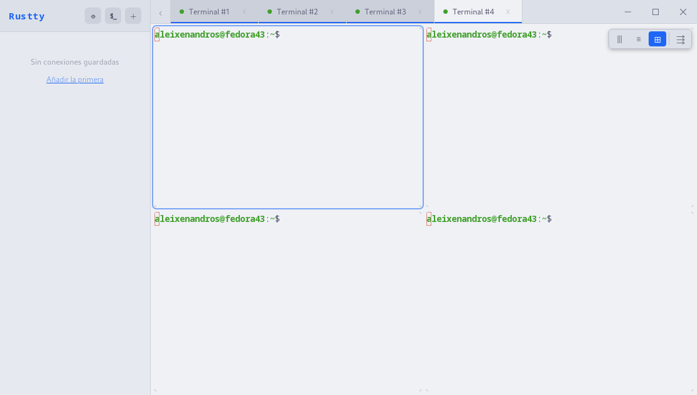
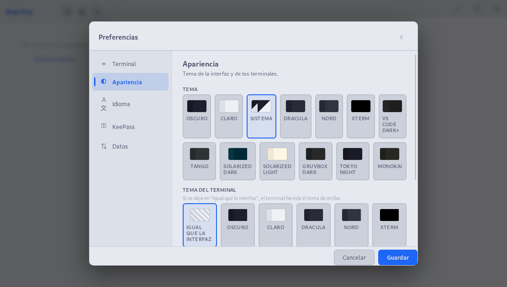

# Rustty - Cliente SSH Multiplataforma🦀⚡

> ⚠️ **Aviso**: este repositorio contiene código y documentación generados en parte con agentes de IA.
> Las contribuciones y/o críticas son bienvenidas.

**Rustty** es un cliente de terminal y gestor de conexiones multiplataforma, moderno y ligero, diseñado para ofrecer una experiencia fluida en la administración de servidores remotos. Construido con **Rust** y **Tauri**, combina la potencia de las herramientas de bajo nivel con una interfaz web moderna y ágil.

> 🚧 **Estado**: proyecto en desarrollo activo, aún sin release estable.

## Características principales

- **Multi-protocolo**: conexiones SSH, SFTP y RDP (este último mediante `xfreerdp` / `mstsc` externos).
- **Terminal moderno**: xterm.js con temas, cursor configurable, scrollback y soporte de OSC 7 (seguimiento del `cwd` remoto).
- **Panel SFTP integrado**: explorador de ficheros con subida / descarga, drag & drop, sigue automáticamente el directorio del terminal y permite elevar la sesión a **sudo** cuando el servidor lo permita.
- **Multi-pestaña y vistas divididas**: trabaja con varias sesiones simultáneas, distribúyelas en *split* horizontal / vertical / grid y activa el *broadcast* para teclear en varias a la vez.
- **Seguridad**:
  - Integración nativa con el keyring del sistema (KWallet, GNOME Keyring, macOS Keychain, Windows Credential Store).
  - Soporte para bases de datos **KeePass** (`.kdbx`) como fuente de contraseñas.
  - Atajo `Ctrl+Alt+P` para pegar la contraseña del perfil activo sin exponerla en pantalla.
- **Organización**: agrupa perfiles en carpetas y gestiona conexiones desde la barra lateral colapsable.
- **Personalización**: 11 temas base integrados (Catppuccin Mocha / Latte, Dracula, Nord, xterm, VS Code Dark+, Tango, Solarized Dark / Light, Gruvbox Dark, Tokyo Night, Monokai) y ajustes de cursor, scrollback y *bell*. Posibilidad de importar temas personalizados.
- **Internacionalización**: interfaz traducida a español, inglés, francés y portugués. (Traducciones realizadas con IA)

## Capturas

Pantalla de bienvenida con el tema claro del sistema:


Varias sesiones abiertas en pestañas y menú contextual del panel de conexiones (tema oscuro):


Vista dividida en rejilla: cuatro paneles en la misma pestaña con el selector de *layout* en la esquina superior derecha:



Preferencias → **Apariencia**: tema global de la interfaz y tema independiente del terminal (con el *swatch* "Igual que la interfaz" para herencia):



Preferencias → **Idioma**: interfaz disponible en español, inglés, francés y portugués:


## Atajos de teclado

Rustty incluye un **editor de atajos** en Preferencias → *Atajos* que permite reasignar cualquier acción con captura en vivo (pulsa "Editar" y la nueva combinación). Los atajos por defecto son:

| Atajo                          | Acción                                                 |
|--------------------------------|--------------------------------------------------------|
| `Ctrl+Shift+N`                 | Nueva conexión                                         |
| `Ctrl+Shift+T`                 | Nueva consola local                                    |
| `Ctrl+Shift+W`                 | Cerrar pestaña activa                                  |
| `Ctrl+Tab`                     | Pestaña siguiente                                      |
| `Ctrl+Shift+Tab`               | Pestaña anterior                                       |
| `Ctrl+,`                       | Abrir preferencias                                     |
| `Ctrl+Alt+C`                   | Copiar selección del terminal                          |
| `Ctrl+Alt+V`                   | Pegar en el terminal                                   |
| `Ctrl+Alt+P`                   | Pegar la contraseña del perfil activo en el shell      |
| `Ctrl++` / `Ctrl+-` / `Ctrl+0` | Aumentar / disminuir / restablecer el tamaño de fuente |

## Instalación

En cada release de GitHub encontrarás binarios precompilados para Linux, Windows y macOS. Puedes descargarlos desde la página de [Releases](https://github.com/Aleixenandros/Rustty/releases) o desde la web del proyecto: [rustty.es/descargas](https://rustty.es/descargas).

### Instalación rápida con script

En Linux y macOS puedes instalar Rustty con el script oficial:

```bash
curl -sSf https://rustty.es/install.sh | sh
```

El script consulta la última release publicada, detecta tu sistema y descarga el artefacto adecuado. Internamente invoca `sudo` solo cuando lo necesita el gestor de paquetes; **no** ejecutes `sudo sh` sobre todo el script.

Si prefieres revisarlo antes:

```bash
curl -sSf https://rustty.es/install.sh -o install.sh
less install.sh
sh install.sh
```

| Sistema detectado | Artefacto usado | Instalación |
| --- | --- | --- |
| Arch / Manjaro / EndeavourOS | `.pkg.tar.zst` | `sudo pacman -U` |
| Debian / Ubuntu / Mint | `.deb` | `sudo apt-get install` |
| Fedora / RHEL / CentOS / Rocky / AlmaLinux | `.rpm` | `sudo dnf install` |
| openSUSE / SUSE | `.rpm` | `sudo zypper install` |
| Otras distribuciones Linux | `AppImage` | copia en `~/.local/bin/rustty` |
| macOS Apple Silicon | `.app.tar.gz` | extrae en `~/Applications/Rustty.app` |

Para actualizar a una nueva versión, vuelve a ejecutar el mismo comando. En Linux reemplazará el paquete mediante el gestor correspondiente; en macOS reemplazará `~/Applications/Rustty.app`.

> El instalador automático no está disponible para Windows. Usa el MSI, NSIS o portable de la release.

### Linux

Rustty necesita **WebKitGTK 4.1** y **libayatana-appindicator** en tiempo de ejecución (en la mayoría de distribuciones ya están instalados o se resuelven como dependencia al instalar el paquete).

- **AppImage (`Rustty_<version>_amd64.AppImage`)** — portable, no requiere instalación:

  ```bash
  chmod +x Rustty_*_amd64.AppImage
  ./Rustty_*_amd64.AppImage
  ```

- **.deb (Debian / Ubuntu / Mint / ...)**:

  ```bash
  sudo apt install ./Rustty_*_amd64.deb
  ```

- **.rpm (Fedora / openSUSE / RHEL / ...)**:

  ```bash
  sudo dnf install ./Rustty-*-1.x86_64.rpm        # Fedora
  sudo zypper install ./Rustty-*-1.x86_64.rpm     # openSUSE
  ```

- **.pkg.tar.zst (Arch / Manjaro / EndeavourOS / ...)**:

  ```bash
  sudo pacman -U Rustty-*-1-x86_64.pkg.tar.zst
  ```

  Si tu distribución no incluye WebKitGTK 4.1 por defecto, instálalo primero (ver "Requisitos previos" más abajo).

### Windows

- **MSI (`Rustty_<version>_x64.msi`)** — instalador tradicional. Doble clic y seguir el asistente.
- **NSIS (`Rustty_<version>_x64-setup.exe`)** — instalador alternativo, más ligero.
- **Portable (`Rustty_<version>_x64-portable.exe`)** — ejecutable único sin instalar, ideal para memorias USB o equipos bloqueados.

En todos los casos se requiere **Microsoft Edge WebView2 Runtime** (ya incluido en Windows 10 22H2 y Windows 11). Si tu sistema no lo tiene, el instalador MSI/NSIS lo descargará automáticamente; para el portable, instálalo a mano desde [aquí](https://developer.microsoft.com/microsoft-edge/webview2/).

#### Modo portable real

Cuando Rustty se ejecuta como `Rustty_<version>_x64-portable.exe` (filename con sufijo `-portable.exe`), **no usa `%APPDATA%`**. Almacena toda la configuración en una carpeta `.conf\com.rustty.app\` creada automáticamente **junto al propio ejecutable**. Esto incluye `profiles.json` y otros datos de la app, así que el USB queda *self-contained*: cópialo a otro equipo y la configuración viaja con él.

Salvedades:

- El **keyring de Windows** (Credential Manager) sigue siendo del usuario que ejecuta el binario, no del USB. Las contraseñas guardadas con la opción "Recordar contraseña en el keyring" no viajan con el portable. Para tener todas las credenciales en el USB usa una base **KeePass `.kdbx`** y referénciala desde Preferencias → KeePass.
- El estado de la ventana (tamaño, posición) sí se guarda en el perfil de usuario (plugin `tauri-plugin-window-state`); la sesión visual del USB no es 100% portable.
- Si renombras el `.exe` y le quitas el sufijo `-portable.exe`, vuelve al modo normal y leerá `%APPDATA%\com.rustty.app\`.

### macOS (Apple Silicon)

Las builds se firman con **Developer ID Application** y se notarizan con el servicio de Apple, así que Gatekeeper no muestra avisos en una instalación limpia.

- **DMG (`Rustty_<version>_aarch64.dmg`)**: abrir el `.dmg` y arrastrar `Rustty.app` a `Aplicaciones`.
- **App bundle (`Rustty_aarch64.app.tar.gz`)**: descomprimir y ejecutar `Rustty.app`.

> Las builds sólo se generan para **aarch64** (Apple Silicon). Para Intel Mac habría que compilar desde fuente.

### Verificación de integridad

Junto a cada artefacto se publica su `.sig` (firma del updater de Tauri) y la página del release incluye el `sha256` de cada fichero. Para verificar:

```bash
sha256sum Rustty_*_amd64.deb
# comparar con el hash indicado en la release
```

## Tecnologías utilizadas

- **Backend**: [Rust](https://www.rust-lang.org/) — 100% puro para SSH y SFTP (sin dependencia de `libssh2`).
- **Framework de App**: [Tauri v2](https://tauri.app/)
- **Frontend**: [Vite](https://vitejs.dev/) + Vanilla JavaScript / CSS
- **Terminal**: [xterm.js](https://xtermjs.org/)
- **Protocolos**: [russh](https://github.com/warp-tech/russh) (SSH), [russh-sftp](https://github.com/warp-tech/russh-sftp) (SFTP)
- **Seguridad**: [keyring-rs](https://github.com/hwchen/keyring-rs), [keepass-rs](https://github.com/sseemayer/keepass-rs)

## Desarrollo y Construcción

Si deseas compilar el proyecto desde el código fuente, sigue estos pasos:

### Requisitos previos

1. **Rust**: [Instalar Rust](https://www.rust-lang.org/tools/install)
2. **Node.js**: v18 o superior.
3. **Dependencias de sistema**:

   #### Linux (compilación)

    **Ubuntu / Debian**:

    ```bash
    sudo apt-get install -y libwebkit2gtk-4.1-dev libappindicator3-dev librsvg2-dev patchelf libssl-dev pkg-config
    ```

    **Fedora**:

    ```bash
    sudo dnf install webkit2gtk4.1-devel libayatana-appindicator-devel librsvg2-devel openssl-devel
    ```

    **Arch Linux**:

    ```bash
    sudo pacman -S webkit2gtk-4.1 libayatana-appindicator librsvg openssl
    ```

    **openSUSE**:

    ```bash
    sudo zypper install webkit2gtk3-devel libayatana-appindicator3-devel librsvg-devel libopenssl-devel
    ```

   #### macOS (compilación)

    Es necesario tener instaladas las **Xcode Command Line Tools** y [Homebrew](https://brew.sh/).

    ```bash
    brew install openssl pkg-config
    ```

   #### Windows (compilación)

    Es necesario instalar las [Visual Studio C++ Build Tools](https://visualstudio.microsoft.com/visual-cpp-build-tools/) y tener instalado el **WebView2 Runtime** (incluido por defecto en Windows 10 y 11).

### Pasos para ejecutar en desarrollo

1. Clona el repositorio:

    ```bash
    git clone https://github.com/Aleixenandros/Rustty.git
    cd Rustty
    ```

2. Instala las dependencias de Node.js:

    ```bash
    npm install
    ```

3. Ejecuta la aplicación en modo desarrollo:

    ```bash
    npm run tauri dev
    ```

### Construcción para producción

Para generar el ejecutable optimizado para tu sistema operativo:

```bash
npm run tauri build
```

El binario y los paquetes (`.deb`, `.rpm`, `.AppImage`, `.msi`, `.dmg`, según plataforma) quedan en `src-tauri/target/release/bundle/`.

### Release automático

El workflow de GitHub Actions (`.github/workflows/build.yml`) compila binarios para Linux, Windows y macOS (Apple Silicon) al empujar un tag `v*`:

```bash
git tag v0.1.0
git push --tags
```

Los artefactos quedan en un release de GitHub en modo borrador.

## Rutas de datos

- **Linux**: `~/.local/share/com.rustty.app/` (perfiles, configuración)
- **macOS**: `~/Library/Application Support/com.rustty.app/`
- **Windows**: `%APPDATA%\com.rustty.app\`

Las contraseñas no se guardan en estos ficheros: viven en el keyring del sistema con el servicio `rustty`, o se resuelven desde una base KeePass referenciada por UUID.

---

## 📄 Licencia

Rustty se distribuye bajo la licencia [Apache License, Version 2.0](LICENSE).

```text
Copyright 2026 Alejandro Soriano

Licensed under the Apache License, Version 2.0 (the "License");
you may not use this file except in compliance with the License.
You may obtain a copy of the License at

    http://www.apache.org/licenses/LICENSE-2.0
```

Ver el fichero [NOTICE](NOTICE) para las atribuciones requeridas al redistribuir.

---
